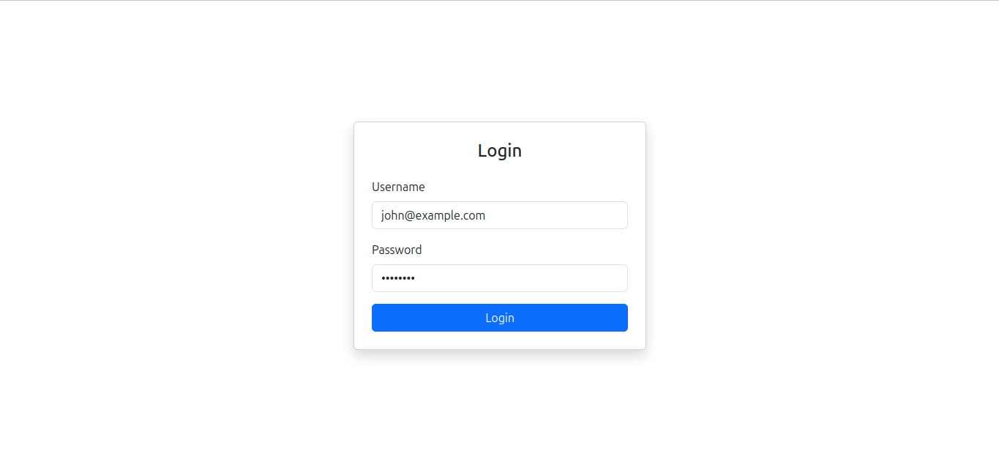
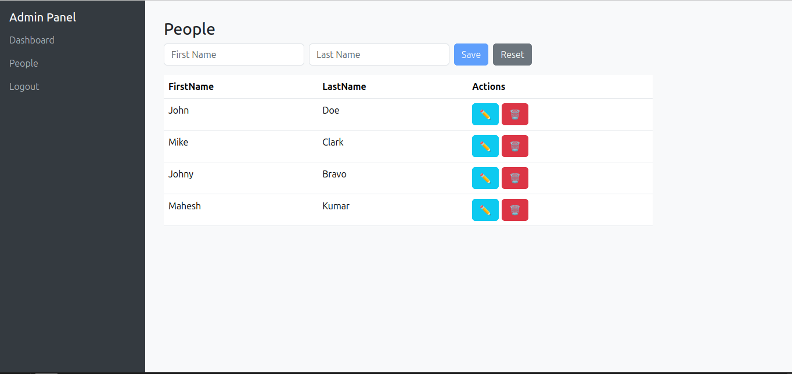

# FullStack CRUD project with authentication and authorization

## Tech used

- Node js (22.14)
- Express js
- Sequelize (ORM)
- Microsoft Sql Server 2022
- Angular 20

## Libraries used in backend

- bcrypt (hashing the password)
- cookie-parser (parsing recieved cookie)
- cors (managing cross origin requests)
- dotenv (for manipulating .env file)
- express (for creating rest apis)
- helmet (adding security headers)
- joi (validation)
- jsonwebtoken (for handling JWT)
- sequelize (ORM)
- tedious (sql server driver)

## How to run project

- Clone the project

### backend

- Create a database named `PersonDb`.
- In terminal, visit to directory named `backend`
- In terminal run the command `npm i`, which will install all the required npm packages
- `Code .` will open your project in VS Code (I am assuming you are using it).
- Open the `.env` file and set database these environment variables (`DB_HOST`,`DB_PORT`,`DB_USERNAME`,`DB_PASSWORD`) according to your sql server database. `DB_NAME` and `DB_PASSWORD` would remain unchanged.
- Run the project (`npm run dev`) and the database should be created itself.

### front end

- In terminal, visit to directory named `client`
- In terminal run the command `npm i`, which will install all the required npm packages.
- `ng serve --open` to run the project.

## API documentation

You can find api documentation in `auth.http` and `person.http` files. To make these http request, you have to install the extension named `REST Client by Huachao Mao`.

## Register as admin

By default, user is registered as 'user' role. If you want to register as `admin`, make sure to make the change in `signup` function of `user.controller.js`

```js
// src/user.controller.js

// signup function
const signup = async (req, res) => {
 
 // other code
 
 await Users.create({
            Email: req.body.email,
            PasswordHash: passwordHash,
            Role: "admin"
        });

 // remaining code       
}
```

## Screenshots

Login


People
